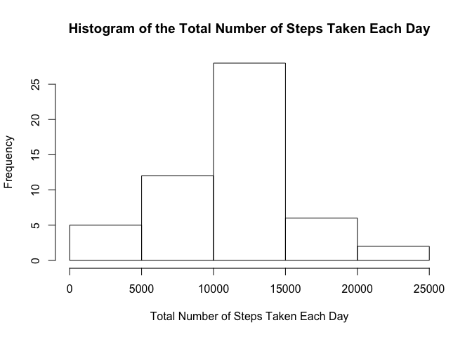
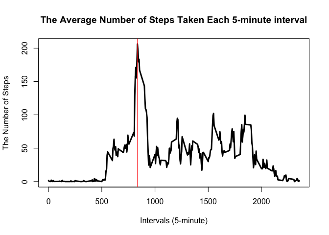
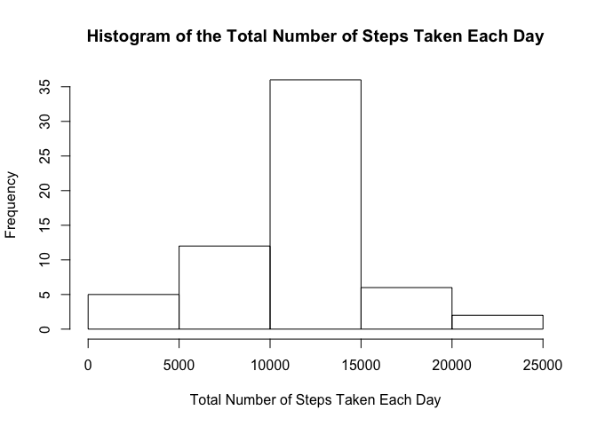
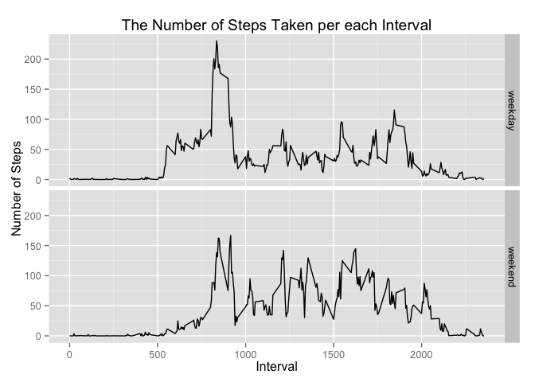

# Reproducible Research: Peer Assessment 1

## Loading and preprocessing the data


```r
setwd("~/repos/RepData_PeerAssessment1")
data <- read.csv("activity.csv")
str(data)
```

```
## 'data.frame':	17568 obs. of  3 variables:
##  $ steps   : int  NA NA NA NA NA NA NA NA NA NA ...
##  $ date    : Factor w/ 61 levels "2012-10-01","2012-10-02",..: 1 1 1 1 1 1 1 1 1 1 ...
##  $ interval: int  0 5 10 15 20 25 30 35 40 45 ...
```

```r
summary(data)
```

```
##      steps                date          interval     
##  Min.   :  0.00   2012-10-01:  288   Min.   :   0.0  
##  1st Qu.:  0.00   2012-10-02:  288   1st Qu.: 588.8  
##  Median :  0.00   2012-10-03:  288   Median :1177.5  
##  Mean   : 37.38   2012-10-04:  288   Mean   :1177.5  
##  3rd Qu.: 12.00   2012-10-05:  288   3rd Qu.:1766.2  
##  Max.   :806.00   2012-10-06:  288   Max.   :2355.0  
##  NA's   :2304     (Other)   :15840
```

## What is mean total number of steps taken per day?

1. Make a histogram of the total number of steps taken each day

```r
histPlot <- tapply(data$steps,data$date,sum)
hist(histPlot, xlab = "Total Number of Steps Taken Each Day", 
     main = "Histogram of the Total Number of Steps Taken Each Day")
```

 

2. Calculate and report the mean and median total number of steps taken per day

```r
mean_day <- mean(histPlot[!is.na(histPlot)])
median_day <- median(histPlot[!is.na(histPlot)])
print(mean_day)
```

```
## [1] 10766.19
```

```r
print(median_day)
```

```
## [1] 10765
```

The mean total number of steps taken per day is 10766.19.
The median total number of steps taken per day is 10765.

## What is the average daily activity pattern?

1. Make a time series plot (i.e. type = "l") of the 5-minute interval (x-axis) and the average number of steps taken, averaged across all days (y-axis)


```r
noNA <- data[!is.na(data$steps),]
itv <- tapply(noNA$steps,noNA$interval,mean)
itv <- data.frame(as.numeric(as.character(names(itv))),itv)
names(itv) <- c("interval","value")
with(itv,plot(interval,value, type = "l", lwd = 3,
              xlab = "Intervals (5-minute)", ylab = "The Number of Steps", 
              main = "The Average Number of Steps Taken Each 5-minute interval"))
abline(v = as.numeric(names(which.max(itv$value))), lty = 1, lwd = 1, col = "red")
```

 

2. Which 5-minute interval, on average across all the days in the dataset, contains the maximum number of steps?


```r
names(which.max(itv$value))
```

```
## [1] "835"
```

```r
unname(which.max(itv$value))
```

```
## [1] 104
```

The 5-minute interval with the biggest number of steps is 835 (the 104th interval).

## Imputing missing values
1. Calculate and report the total number of missing values in the dataset (i.e. the total number of rows with NAs)


```r
sum(is.na(data$steps))
```

```
## [1] 2304
```

The total rows containing missing values are 2304.

2. Devise a strategy for filling in all of the missing values in the dataset. The strategy does not need to be sophisticated. For example, you could use the mean/median for that day, or the mean for that 5-minute interval, etc.

The strategy is to use the mean for that 5-minute interval instead of the missing value, if a value shows NA.

3. Create a new dataset that is equal to the original dataset but with the missing data filled in.


```r
for (i in 1:17568){
       if (is.na(data$steps[i]) == TRUE){
               for (j in 1:288){
                       if (data$interval[i] == itv$interval[j]){
                               data$steps[i] <- itv$value[j]
                       }
               }
       } 
}
```

4. Make a histogram of the total number of steps taken each day and Calculate and report the mean and median total number of steps taken per day. Do these values differ from the estimates from the first part of the assignment? What is the impact of imputing missing data on the estimates of the total daily number of steps?


```r
histPlot <- tapply(data$steps,data$date,sum)
hist(histPlot, xlab = "Total Number of Steps Taken Each Day", 
     main = "Histogram of the Total Number of Steps Taken Each Day")
```

 

```r
mean(histPlot[!is.na(histPlot)])
```

```
## [1] 10766.19
```

```r
median(histPlot[!is.na(histPlot)])
```

```
## [1] 10766.19
```

The mean total number of steps taken per day is 10766.19.
The median total number of steps taken per day is 10766.19.

Compared with the result with missing values, the mean remains unchanged, while there is a slight increase in the median as replacing NAs enables the median calculation to take more values into consideration.

## Are there differences in activity patterns between weekdays and weekends?

1. Create a new factor variable in the dataset with two levels -- "weekday" and "weekend" indicating whether a given date is a weekday or weekend day.


```r
data$week <- weekdays(as.Date(data$date))
for (i in 1:17568){
        if (data$week[i]== "Monday"|data$week[i]== "Tuesday"|data$week[i]== "Wednesday"|
            data$week[i]== "Thursday"|data$week[i]== "Friday"){
                data$week[i] <- "weekday"
        }else{
                data$week[i] <- "weekend"
        }
}
a <- subset(data,week == "weekday")
b <- subset(data,week == "weekend")
a <- tapply(a$steps,a$interval,mean)
b <- tapply(b$steps,b$interval,mean)
a <- cbind(as.numeric(as.character(names(a))),a,rep("weekday",288))
b <- cbind(as.numeric(as.character(names(b))),b,rep("weekend",288))
final <- rbind(a,b)
final <- suppressWarnings(data.frame(final))
names(final) <- c("interval","avg","week")
final$interval <- as.numeric(as.character(final$interval))
final$avg <- as.numeric(as.character(final$avg))
```

2. Make a panel plot containing a time series plot (i.e. type = "l") of the 5-minute interval (x-axis) and the average number of steps taken, averaged across all weekday days or weekend days (y-axis). The plot should look something like the following, which was created using simulated data:


```r
library(ggplot2)
ggplot(final, aes(interval, avg)) + geom_line() + facet_grid(week ~ .) + 
        labs(title = "The Number of Steps Taken per each Interval", x = "Interval", y = "Number of Steps") 
```

 


